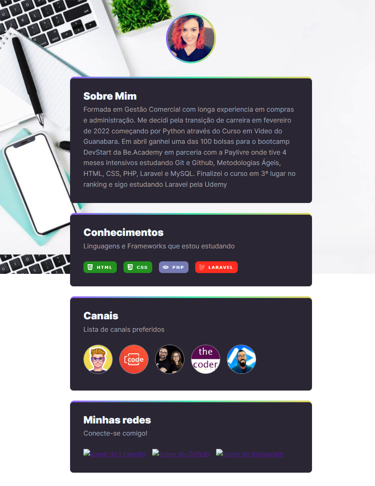

# NLW - Rocketseat

NLW é o um evento online e gratuito de programação na prática desenvolvido pela Rocketseat.

O projeto raiz era sobre games, mas fiz uma adaptação para tornar o projeto, num cartão pessoal de apresentação.

 

## 👉🏻 Deploy:  [Aqui](https://bethania-freitas.github.io/NLW-esports-explorer/)

 

## 😲 Preview:
 

  

## 💻 Tecnologias:

- HTML  
- CSS
- Git e Github 

 

## 👧🏻  Autores:

- [Bethânia Freitas](https://github.com/Bethania-Freitas)

